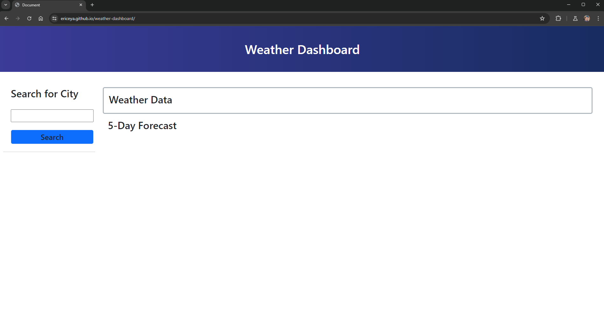
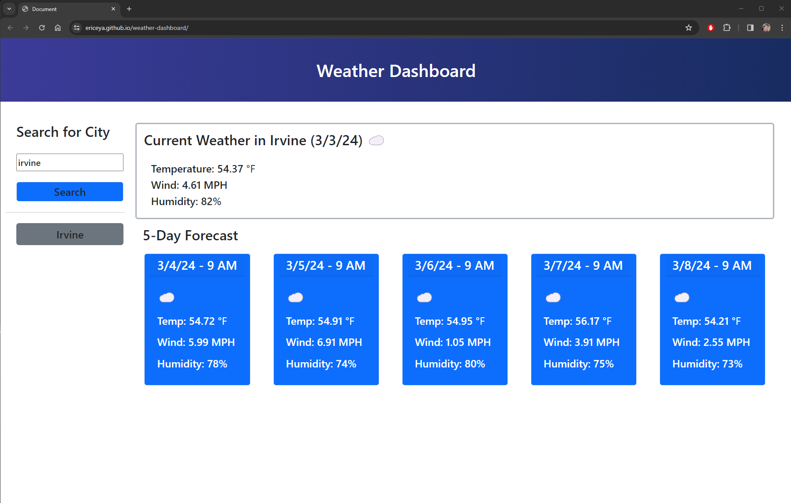
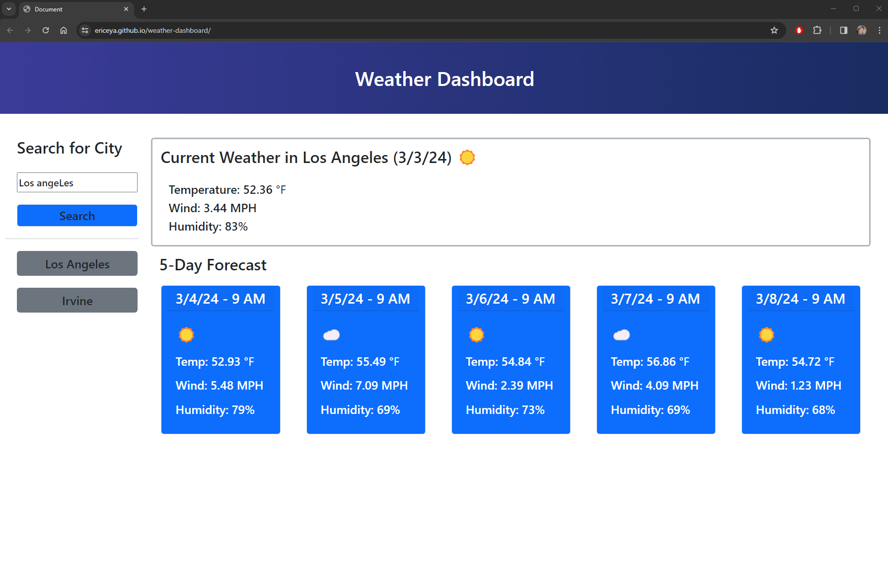
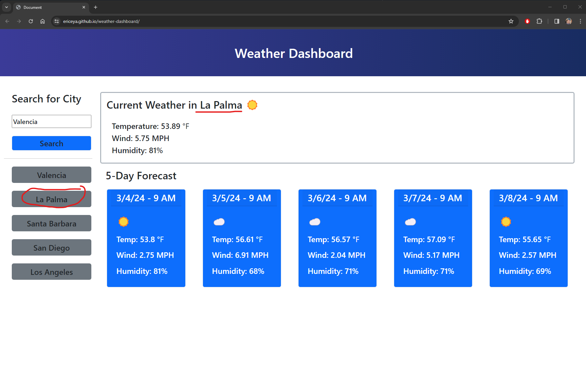

# Weather dashboard

This is a project for implementing third party API that is responsive to user interactions. OpenWeather API has been utilized to extract current weather data in a city and the next 5 day forecast in that city.

## Features of the project

* Utilizing third party API for `fetch()`
* Iteration through API data
* `dayjs()` to show time in formatted string
* Iteration through html element data properties to obtain necessary data
* DOM Traversal to set attributes / texts.

## Screenshots of the deployed page

## Link to deployed page

[Click here to view deployed page](https://ericeya.github.io/weather-dashboard)